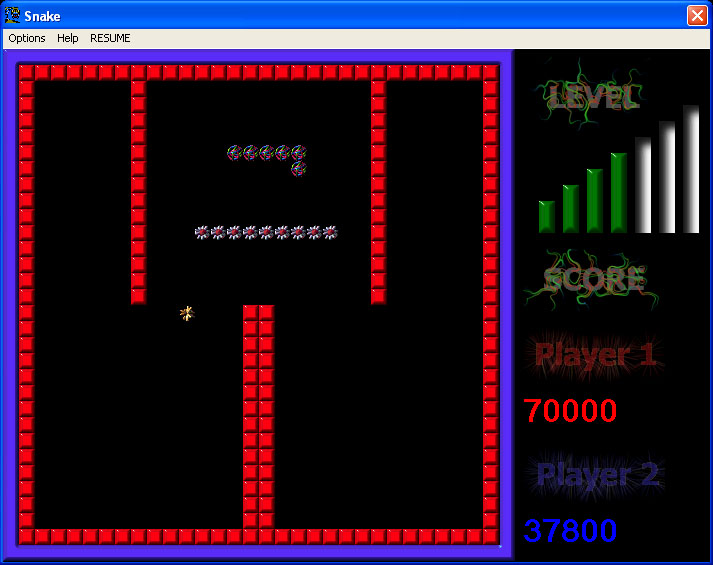



## \[ \* \* \* The Ultimate Snake \* \* \* \]

### Description

This game fo snake is different from many others. In addition to the classic snake game,

this game ships many new features such as 2 modes: classic and campaign,where in campaign mode

you can progress through different levels by eating food and avoid being hit in the walls or

on your own body.According to me, the most novel idea in the game is theat it supports a two

player option in both the modes. The players can compete through various levels of exciting gameplay

for hours. Initially, there are 7 levels in the campaign modes, but the the game is so stuctured that

almost anyone can add new levels to the game. If so, please mail me the code for those levels.

If you like the game, please encourge me by giving your valuable votes.
 
### More Info
 

             |
---                |---
**Submitted On**   |2005-01-22 20:21:50
**By**             |[Sandeep\.G](https://github.com/Planet-Source-Code/PSCIndex/blob/master/ByAuthor/sandeep-g.md)
**Level**          |Intermediate
**User Rating**    |4.5 (118 globes from 26 users)
**Compatibility**  |VB 6\.0
**Category**       |[Games](https://github.com/Planet-Source-Code/PSCIndex/blob/master/ByCategory/games__1-38.md)
**World**          |[Visual Basic](https://github.com/Planet-Source-Code/PSCIndex/blob/master/ByWorld/visual-basic.md)
**Archive File**   |[\[\_\_\_\_\_\_\_Th184646212005\.zip](https://github.com/Planet-Source-Code/sandeep-g-the-ultimate-snake__1-58604/archive/master.zip)

